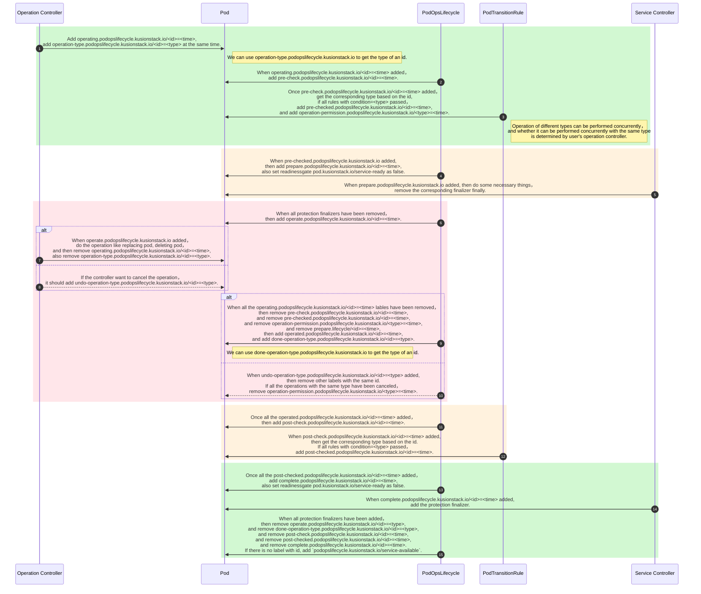

## Summary

Kubernetes provides a set of default controllers for workload management, like StatefulSet, Deployment, DaemonSet for instances. While at the same time, when a pod managed by this controllers undergoes changes, if the traffic is not completely stopped, it will result in some degree of traffic loss.

PodOpsLifecycle attempts to provide Kubernetes administrators and developers with finer-grained control the entire lifecycle of a pod. For example, we can develop a controller to do some necessary things in both the trafficoff and trafficon phases to avoid traffic loss.

## Goals

1. Provides extensibility that allows users to control the lifecycle of pods using the podopslifecycle mechanism.
2. Provide some concurrency, multi controllers can operate the pod in the same time. For example, when a pod is going to be replaced, other controllers may want to delete it.
3. All the lifecycle phases of a pod can be tracing.

## Design Details

1. Podopslifecycle mechanism is provided by a mutating webhook server and a controller. The mutating webhook server will chage the labels at the right time, and the controller will set the readinessgate `pod.kusionstack.io/service-ready` to true or false if necessary. The controller will also chage the label at some time.
2. The label `operating.podopslifecycle.kusionstack.io/<id>=<time>` and `operation-type.podopslifecycle.kusionstack.io/<id>=<type>` will be validated by a validating webhook server, they must be added or removed at the same time by the operation controller.
3. Service controller should turn the traffic on or off based on label `prepare.podopslifecycle.kusionstack.io/<id>=<time>` and `complete.podopslifecycle.kusionstack.io/<id>=<time>`.
4. Protection finalizer names must have prefix `prot.podopslifecycle.kusionstack.io`. They are used to determine whether the traffic has been completely removed or is fully prepared.
5. The special label `podopslifecycle.kusionstack.io/service-available` indicate a pod is available to serve.
6. We can use the message `<id>=<time>` and `<id>=<type>` in the labels to tracing a pod. The `<time>` is a unix time.

Below is the sequence diagram of podopslifecycle mechanism.

