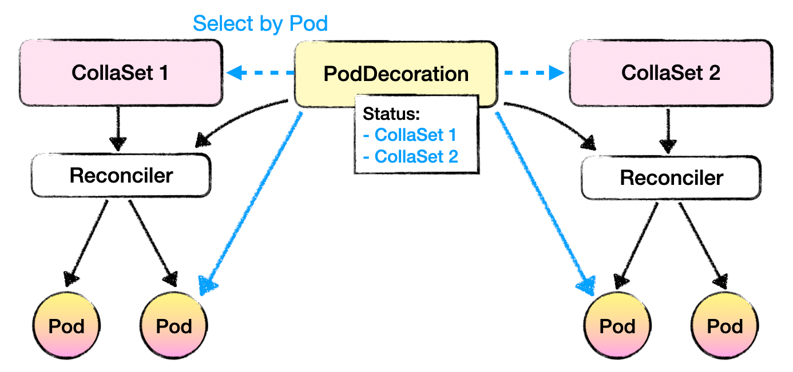
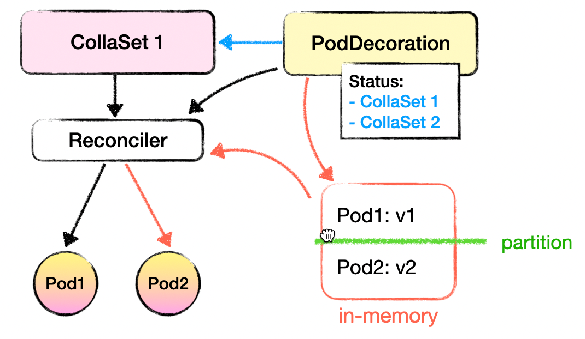

# Pod Decoration Support

## Motivation

There are configurations, such as Sidecar, schedule parameters, are expected to be maintained separately by teams other than application developers.
In practice, SRE team always wants to update Sidecar configurations without awareness of app developers.

In this proposal, we introduce the Kubernetes API PodDecoration, which aims to provide a way to maintain these additional configurations of Pods, independently with CollaSets.

## Proposal

The PodDecoration API is designed as follows:

``` yaml
apiVersion: apps.kusionstack.io/v1alpha1
kind: PodDecoration
metadata:
  name: foo
  namespace: test-update
spec:
  historyLimit: 20        # Number of ControllerRevision to reserve.
  selector:               # Select the Pods to inject config.
    matchLabels:          # Select a group of Pods by labelSelector.
      app: foo
    matchExpressions:     # Or select specific Pods by matchExpressions.
    - key: instance-id
      operator: "In"
      values:
      - "0"
      - "1"
  updateStrategy:
    rollingUpdate:      # Provide several ways to select Pods to update new revision.
      byPartition:
        partition: 2
      bySelector:
        matchLabels:
          app: foo
        matchExpressions:
        - key: instance-id
          operator: "In"
          values:
          - "0"
          - "1"
  injectStrategy:
    group: envoy    # PDs with same group do injection exclusively. 
    weight: 10      # In same group, heavier PD has higher priority to inject exclusively.
  template:
    podTemplate:
      metadata:
        labels:
          extra-label: label-value
          existing-label: label-value
      spec:
        containers:              # Update by replace. If there is app container with the same name, overwrite it.
        - name: sidecar
          image: nginx:1.23.0
          orderPriority: 1       # Order to inject. The greater ones placed at the front. Zero represents the position of containers from CollaSet podTemplate.
        appContainers:           # Update by merge. If a name indicated, then merge to the contrainer with the matched name, otherwise update the last one.
        - name: app
          image: nginx: 1.23.0
          env:
          - name: SIDECAR_INJECTED
            value: "true"
          volumeMounts:
          - name: foo
            mountPath: /tmp/foo
        volumes:
        - name: foo
          hostPath:
            path: /tmp/foo
        affinity:
          overrideAffinity:     # Update by replace
            nodeAffinity:
            podAffinity:
            podAntiAffinity:
          nodeSelectorTerm:     # Update by merge
            matchExpressions:
            matchFields:
        tolerations:
        - key: schedule         # Replace item with same key
          operator: Equal
          value: foo
        runtimeClassName: rund
status:
  affectedWorkloads:
  - name: collaset-a
  - name: collaset-b
```

## Implementation

### Pod Selection

`spec.selector` indicates the Pods to inject. Users can inject Pods one by one through adjusting this selector.
`spec.updateStrategy.rollingUpdate` is responsible for canary updating Pods to updatedRevision.

### How to decide the inject order between multiple PDs

* Multiple PDs with different groups

Inject all the PDs one by one in alphabet-number order from 'a' to 'z'. The latter will overwrite the former.

* Multiple PDs with same group and different weights

Only inject the PD with the higher priority. Ignore the rest ones.

* Multiple PDs with same group and same weight

Inject all the PDs one by one in chronological order, with the older ones being handled first.

### Reuse CollaSet to update Pods

PodDecoration selects Pods and update them under the control of CollaSet, not PodDecoration! 
In this way, Pod additional configurations can be updated in the way app developers indicated in CollaSet spec.

#### PodDecoration and CollaSet relationship maintaining

* PodDecoration -> CollaSet: `PodDecoration.status.affectedWorkloads` records "the owner CollaSets of selected Pods'" and "the owner CollaSets PD of the Pods PD ever injected"
* CollaSet -> PodDecoration: we build this relationship in `FieldIndex` using the records in `PodDecoration.status.affectedWorkloads`.



#### Case 1: PD injection when CollaSet already exists

* PD created event triggers CollaSet reconciling

CollaSet controller need watch the events of PD, deciding the CollaSets need to reconcile from the records in `PodDecoration.status.affectedWorkloads`.

* CollaSet updates Pods
  * CollaSet controller finds all the PDs selecting its Pods from FieldIndex.
  * CollaSet calculates the Pod final revision depending on CollaSet podTemplate and every PD podTemplates. Pod annotation also records its current revision. If these two revision is different, this Pod is out of update.
  * CollaSet render the Pod final yaml using the CollaSet podTemplate and every PD podTemplate.

#### Case 2: Day-2 operation. Canary update Pod additional configuration

When updating, PodDecoration controller will store and maintain the Pods partition information using a data in memory.
This partition data will be used by CollaSet controller to decide the effective revision of each PodDecoration. 



#### Case 3: How to decide the Pod revision when it is created during PD update.

* Users can set the policy to decide whether to use the current revision or updated revision to inject into the created Pod. Using updated revision by default.
* Controllers should consider this new Pod and tolerate that its revision break the desired partition status, and do not update it to match the expected partition. 

## Key features

* Active Pod upgrading capability

PodDecoration will actively trigger Pods injection and update with latest revision. There is no need to do other operations.

* All Pod configurations support

Technically, PodDecoration is able to support to inject and update almost all Pod configurations.
Recently, we plan to support some common configuration, such as container, initContainer, volume, affinity, toleration, etc. 

* PodOpsLifecycle support

PodDecoration updates Pod based on PodOpsLifecycle.

